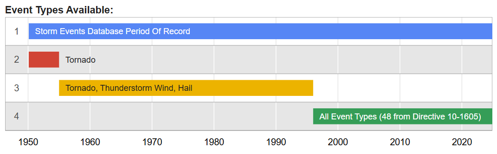
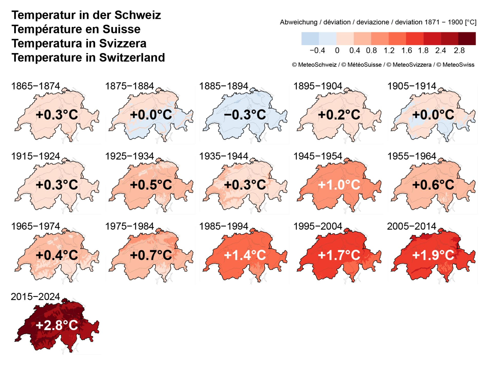
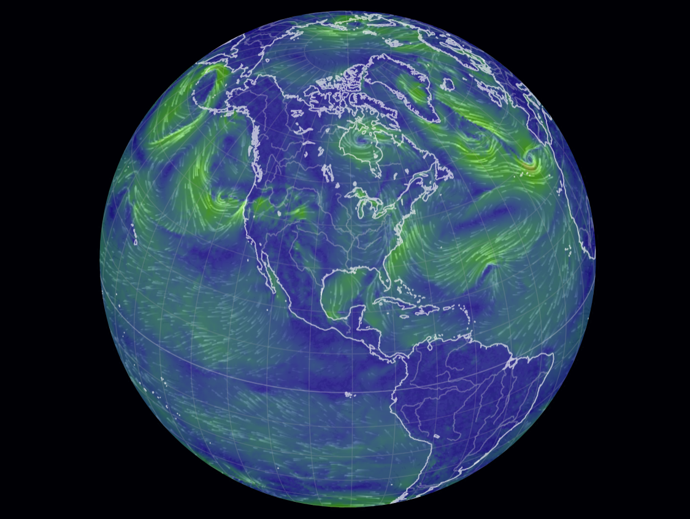
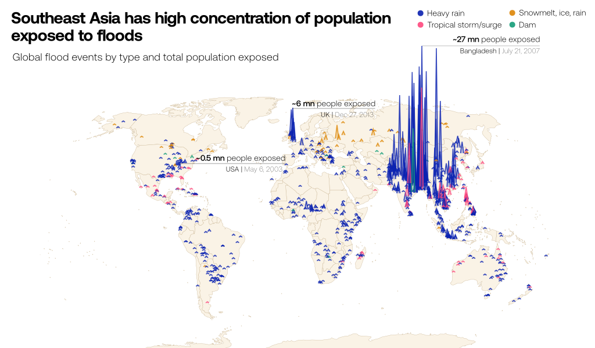
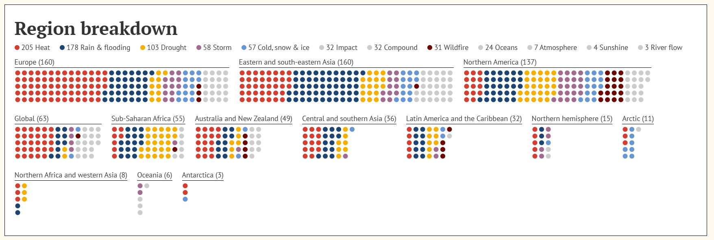

# Ça roille aux states - A data visualization project 🌪️🌀

| Student's name | SCIPER | 
| -------------- | ------ |
| Timo Michoud   | 302039 |
| Luc Harrison   | 315788 |
| Corentin Genton| 301505 |

## Problematic
### Climate Change Problem 
Climate change is probably the biggest threat ever experienced by mankind. It refers to the long-term alteration of temperatures and weather patterns in a place. Due primarily to human activities, greenhouse gases such as methane and carbon dioxide are accumulating in the atmosphere and trapping the sun's heat causing the overall temperature to rise, a phenomenon known as global warming. In recent years, the effects of Climate change have become more and more visible as the average temperature of the planet went up by [1.2 °C](https://www.un.org/en/climatechange/what-is-climate-change) since the 1800s. As the Earth warms, it disrupts natural weather systems, contributing to more frequent and more intense extreme weather events such as heatwaves, hurricanes, floods, or droughts. Warmer temperatures can lead to more water vapor in the atmosphere, making storms more powerful. Even more so, it accelerates the melting of glaciers causing the sea level to rise and increasing the risk of coastal floodings. The increasing danger of this kind of events is a serious threat to our societies and to the safety of many populations. Even though it seems nearly impossible to revert the climate change as the economics and politics of our world stand now, we can at least try to understand and perdict better the changes that are happening. This will be the goal of our project as we will try to obtain a visualisation of the extreme environmental events that happened over the last years in the United States of America. 

### The Special Case of the USA
The United States is known for experiencing a high number of extreme weather events, not only due to its vast size but also because of its unique geographical and climatic conditions. We all have in our minds cases of extreme weather events happening in the united states such as the Katrina hurricane in 2004 or even this year, with the wild fires in California intensified by exceptionally [high winds](https://www.worldweatherattribution.org/climate-change-increased-the-likelihood-of-wildfire-disaster-in-highly-exposed-los-angeles-area/). Such events cost the lives of thousands of people and brought major damages to the regions they hit but we must not forget about the many smaller size events happening very frequently and bringing their own casualties. 
Among these, tornadoes are particularly frequent, making the U.S. the most tornado-prone country in the world with around 1,200 tornadoes occuring annually. The central area consisting a line between Texas and South Dakota is especially susceptible to tornadoes due to the collision of warm, moist air from the Gulf of Mexico with cool, dry air from Canada, creating the ideal conditions for powerful thunderstorms that can generate tornadoes. Although tornadoes also occur in other countries, none experience them as frequently as the U.S.

In addition to tornadoes, the United States is also highly susceptible to hurricanes, which are particularly common along the East coast. The Atlantic hurricane season runs from June to November, with states such as Florida, Texas, and Louisiana frequently bearing the brunt of these powerful storms. Hurricanes bring destructive winds, storm surges, and heavy rainfall, often leading to widespread flooding and infrastructure damage. The Gulf of Mexico’s warm waters and the Atlantic Ocean’s climatic patterns contribute to the formation of these intense cyclones.

Beyond tornadoes and hurricanes, the U.S. also faces other extreme weather phenomena, including blizzards, wildfires, droughts, and heatwaves. The northern and northeastern states, as well as the Midwest, regularly experience severe winter storms, which can cause heavy snowfall, icy conditions, and dangerously low temperatures. Meanwhile, the western states, especially California, are frequently impacted by wildfires, which are exacerbated by prolonged droughts and high temperatures. Heatwaves, particularly in the Southwest, pose significant risks, with states like Arizona and Nevada experiencing dangerously high temperatures during the summer months.

Although extreme weather events are not exclusive to the United States, few countries provide as comprehensive and long-term datasets on these phenomena. Therefore, our analysis and visualizations will primarily focus on the U.S., where reliable data allows for a more in-depth exploration of trends, patterns, and impacts of extreme weather events over time. 

### What we will try to answer
1. How does climate change contribute to the increasing frequency of rare weather events in the USA?
2. What are the economic and human consequences of the growing occurrence of extreme weather events?
3. How can statistical analyses of past events help us understand their causes and improve forecasting?

## Dataset
To answer our problematic we will need some data. As explained before, one reason to focus on the USA is the availability of good data about extreme weather events. Indeed, thanks to the National Oceanic and Atmospheric Administration (NOAA), we have access to the [_Storm Events Database_](https://www.ncdc.noaa.gov/stormevents/), a database documenting:
> - The occurrence of storms and other significant weather phenomena having sufficient intensity to cause loss of life, injuries, significant property damage, and/or disruption to commerce;
- Rare, unusual, weather phenomena that generate media attention, such as snow flurries in South Florida or the San Diego coastal area; and
- Other significant meteorological events, such as record maximum or minimum temperatures or precipitation that occur in connection with another event.

The database currently contains data from January 1950 to November 2024, as entered by NOAA's National Weather Service (NWS). Due to changes in the data collection and processing procedures over time, there are unique periods of record available depending on the event type. NCEI has performed data reformatting and standardization of event types but has not changed any data values for locations, fatalities, injuries, damage, narratives and any other event specific information. Please refer to the Database Details page for more information.

    

As we can see in the image above, the following events were recorded:
1. Tornado: From 1950 through 1954, only tornado events were recorded.

2. Tornado, Thunderstorm Wind and Hail: From 1955 through 1992, only tornado, thunderstorm wind and hail events were keyed from the paper publications into digital data. From 1993 to 1995, only tornado, thunderstorm wind and hail events have been extracted from the Unformatted Text Files.

3. All Event Types (48 from Directive 10-1605): From 1996 to present, 48 event types are recorded as defined in NWS Directive 10-1605.

## Exploratory Data Analysis
The exploratory data analysis can be found in this notebook (add link to notebook). While we won't pass over all the details, some of the numbers are:
- 1937859 unique events
- N unique type of events such as Tornado, Hail, Thunderstorm Wind or Flood
-  

## Related work
### With the same Data 
Ths [Kaggle Notebook](https://www.kaggle.com/code/wumanandpat/exploration-of-storm-events-database) propose a pre-processing as well as some visualizations with the Storm Events Database. 
Concerning now vizualizations with the same dataset as ours ...

We have identified a [website](https://www.arcgis.com/apps/dashboards/2f0a9f25eea3410ca0443bdce936f8e5) that features a visualization using the same dataset as ours.
However, it does not offer a lot of possibilities in terms of visualization. Furthermore, it can quickly become unusable when selecting many events. One nice thing is that it offers some more informations about each events. 

### General weather visualizations
Over the last couple of years many great visualization have been developped in order to show in the most clear way the impact and the reality of the climate change to the public. While we don't directly work with climate change related data such as the increase of the temperatures or ... we can draw inspiration from these visualizations for our own project. 

    

A compelling way to illustrate the evolution of a variable like temperature, while also accounting for geographic variation, is to visualize the map across different years or time periods. [Source](https://www.meteoswiss.admin.ch/climate/climate-change.html)

ADD NASA Climate Spiral, and others ?

We can also draw inspiration from more general weather visualizations such as ....

While searching for visualizations related to weather events, we came across the following ones that caught our attention:

    

    

    

[Source](https://global-flood-database.cloudtostreet.ai/)
[Source](https://earth.nullschool.net/#current/wind/surface/level/orthographic=-97.87,29.90,371)
[Source](https://interactive.carbonbrief.org/attribution-studies/index.html)

<!---
> - What others have already done with the data?
> - Why is your approach original?
> - What source of inspiration do you take? Visualizations that you found on other websites or magazines (might be unrelated to your data).
> - In case you are using a dataset that you have already explored in another context (ML or ADA course, semester project...), you are required to share the report of that work to outline the differences with the submission for this class.
-->

<!---

## Milestone 2 (18th April, 5pm)

**10% of the final grade**

## Milestone 3 (30th May, 5pm)

**80% of the final grade**

-->

